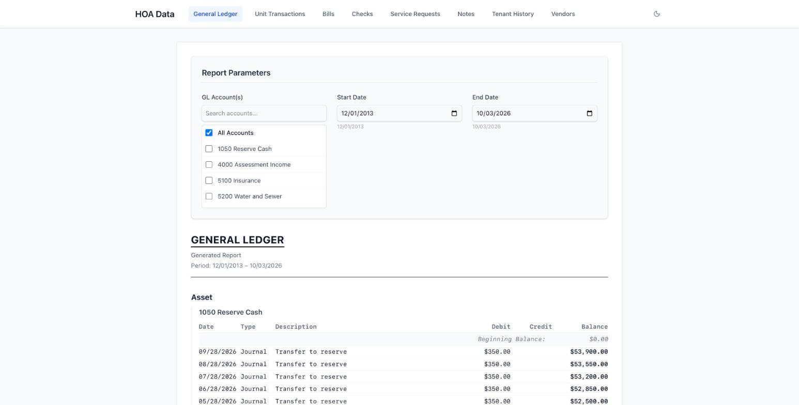
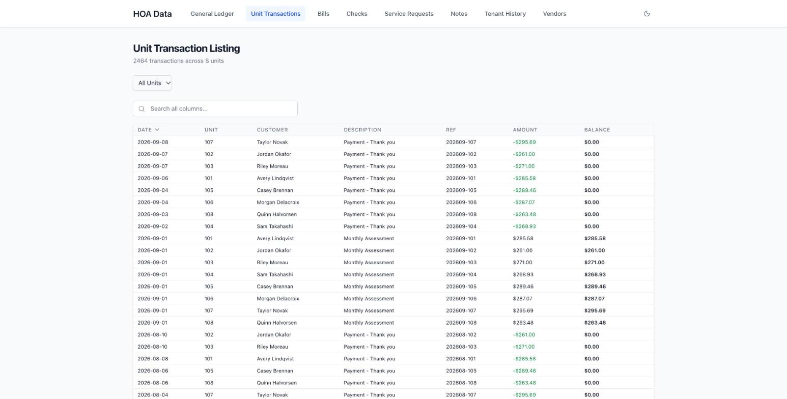
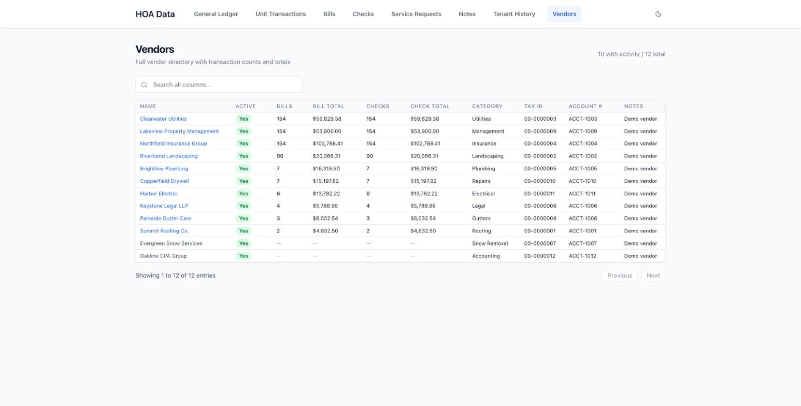

# HOA Records App (demo)

A searchable web archive of a homeowners association's financial history, built after our new board inherited a management company switch and **zero documentation**.

> **Everything in this repository uses fake data.** The association, owners, vendors, amounts and dates in the demo database are invented ("Maple Court Condominiums"). The real app runs privately behind a login and its data is never published.



## The problem

When I joined our condo association's three-person board in September 2025, the board had no records of its own. Everything (13 years of payments, bills, checks, vendor history, inspection reports and legal documents) lived only in the outgoing property manager's online portal, which offered no export and no API. We were about to switch managers, and once that account closed, the history would be gone.

## My role

I acted as the product owner. I decided what the app needed to do, set the priorities, tested each version against the real records, and rolled it out to the people who use it. **The code was written by Claude, Anthropic's AI assistant, under my direction.**

- **Requirements:** a complete copy of every record, searchable by date, owner, vendor and account, with standard financial reports the board could actually read
- **Decisions:** what to extract, how to organize it, which reports mattered, and who should have access
- **Testing:** checked each version against the old portal to make sure nothing was missing or wrong
- **Rollout:** shared it with the other two board members and our new management company

## What it does

| Page | What you can do |
|---|---|
| General Ledger | Run a ledger report for any accounts and date range |
| Unit Transactions | See every charge and payment by unit and owner |
| Bills and Checks | Look up any bill, its due date, and the check that paid it |
| Vendors | Vendor directory with bill and check totals per vendor |
| Service Requests | Work-order history with status and resolution |
| Notes | Dated notes with the documents attached to them |
| Tenant History | Move-in and move-out history by unit |





## Results (real deployment)

- Preserved nearly **13 years** of records (December 2013 onward) before the old account closed: about **9,900 general-ledger entries**, **3,300 owner transactions**, **837 checks**, **604 bills**, **193 vendors** and **383 attached documents**
- The new management company received the full history **before** the outgoing manager sent anything
- Access limited to the board and the management company with **Cloudflare Access**, so sensitive homeowner and financial data stays private

## How it's built

- **Data extraction (not included here):** a Python tool that pulled every record and report from the old manager's portal
- **Database and API:** SQLite served by [Datasette](https://datasette.io), which turns the database into a read-only JSON API
- **Frontend:** React, TypeScript, Tailwind CSS, TanStack Table and React Router, built with Vite
- **Access control:** Cloudflare Access in front of the live site

## Run the demo locally

You need Python 3.11+ with [uv](https://docs.astral.sh/uv/) and Node.js 20+.

```bash
# 1. Build the fake database and start the API on http://localhost:8001
./backend/serve.sh

# 2. In a second terminal, start the website on http://localhost:5173
cd frontend
npm install
npm run dev
```

To regenerate the fake data, run `python3 data/generate_fake_data.py`.

## About the demo data

`data/generate_fake_data.py` creates an 8-unit association with invented owners, vendors, monthly dues, bills, checks, notes and service requests from 2013 to 2026. The tables and views use the same layout as the real app, so the website runs unchanged.

---

Built by Marcella Green with Claude. [LinkedIn](https://www.linkedin.com/in/marcellagreen)
